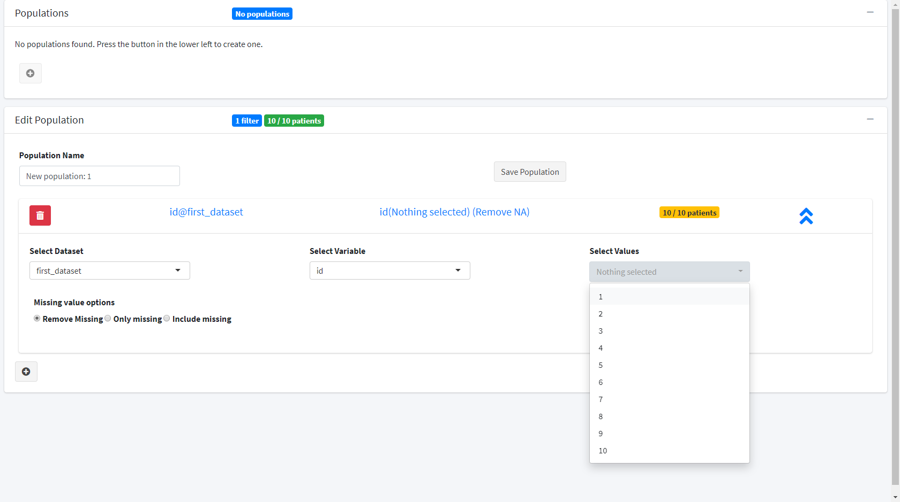

```{r setup, include = FALSE}
library(tidymodules)
library(shiny)
library(subpat)

knitr::opts_chunk$set(
  collapse = TRUE,
  comment = "#>"
)
```

## Introduction
This vignette shows how to use the shiny modules from `{subpat}` in your own applications.

## Subpopulation Module
The subpopulation module provides a _tidymodules_ R6 class.
Using these modules is just as easy as using a standard shiny module.

The input to the module is, `datalist` a reactive list of data sets (tibbles, data frames, etc).
The options passed to the module are reactiveValues

```{r}
sampleopts <- reactive(list(
  # The id variable common to all data sets in `datalist`
  idvar = "id",
  # If only of the tables is a common table (subject level data), then specify here
  subjectDs = NULL
))
```
With these options the module will expect that each data set has a common variable ID.

```{r}
# the constructor takes in an optional id parameter
# if we do not provide it then the module will generate a new id for us
subpopulationModule <- SubpopulationManager$new()
subpopulationModule
```

We can see that from the output the input and outputs are shown as NULL.
The options are `OK` because they default to the ADaM data set format.
We can see this by accessing the options in the module

```{r}
print(
  # Need to wrap in isolate since options is a reactive function
  isolate({
    subpopulationModule$getInput("options")  
  })
)
```

We can pass in the options using one of two options:

```{r}
# Pipe syntax
# Options are port 2
# isolate({
#   sampleopts %>2% subpopulationModule
# })

# using method updateOptionPort
isolate({
  subpopulationModule$updateInputPort("options", sampleopts)
})

# Options are now updated
print(isolate({
  subpopulationModule$execInput("options")
}))
```

We can include this in our shiny app using the following example.
Since the subpopulation module uses bs4Dash features, we need to include it in a [bs4DashPage](https://rdrr.io/github/DivadNojnarg/bs4Dash/man/bs4DashPage.html).

```{r, eval = F}
library(tidymodules)
library(subpat)
library(bs4Dash)

# Optional id to pass into the module
subpopmod <- SubpopulationManager$new(id = "subpopmodule")

ui <- tagList(
  # Need to include shinyjs for the functionality to work
  shinyjs::useShinyjs(),
  bs4DashPage(
    sidebar = bs4DashSidebar(disable = TRUE),
    body = bs4DashBody(
      subpopmod$ui()
    )
  )
)

# Define server logic required to draw a histogram
server <- function(input, output) {
  datalist <- reactive({
    list(
      first_dataset = data.frame(
        id = as.factor(1:10),
        gender = as.factor(round(runif(10))),
        age = round(rnorm(10, mean = 40, sd = 15))
      ),
      second_dataset = data.frame(
        id = factor(c(4,5,6), levels = 1:10),
        event = c("Heart attack", "Stroke", "Stroke")
      )
    )
  })
  
  opts <- reactiveValues(
    # The id variable common to all data sets in `datalist`
    idvar = "id",
    # If only of the tables is a common table (subject level data), then specify here
    subjectDs = NULL
  )
  
  subpopmod$callModule()
  
  observe({
    # Pass the data into the module
    datalist %>1% subpopmod
    
    # Add the options to the filter
    opts %>2% subpopmod
  })
}

# Run the application 
shinyApp(ui = ui, server = server)
```

Results in the follow interface:
