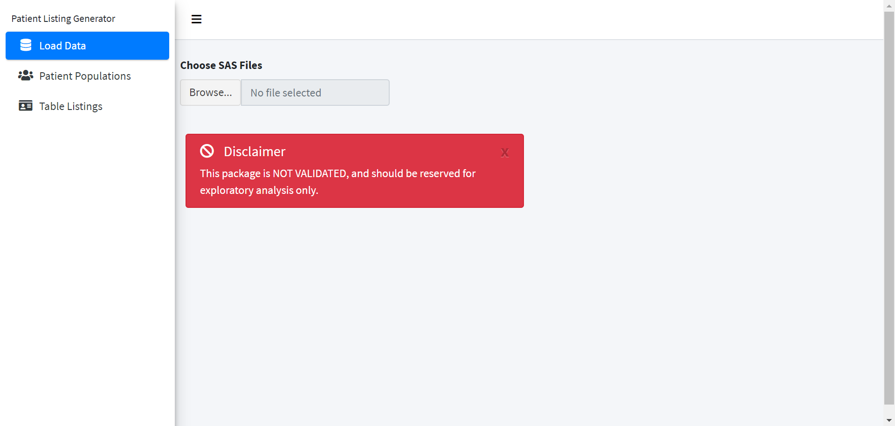
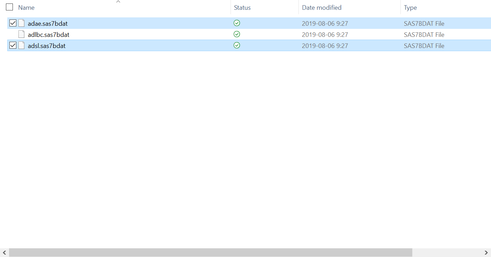
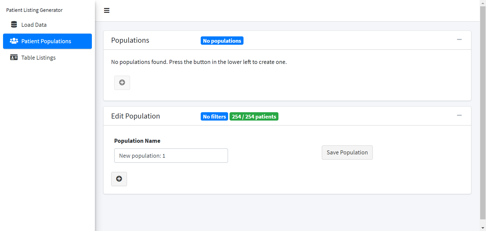
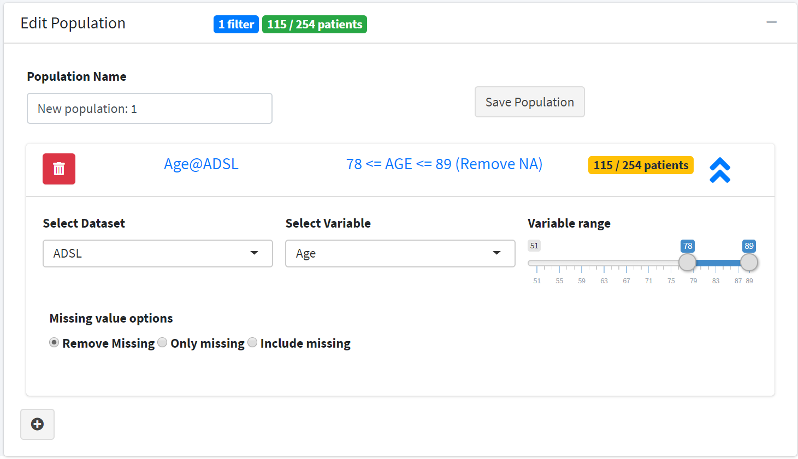
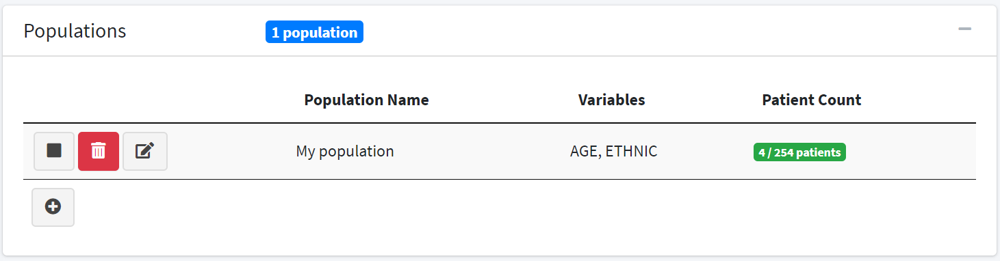

```{r setup, include = FALSE}
library(tidymodules)
library(shiny)
library(subpat)
knitr::opts_chunk$set(
  collapse = TRUE,
  comment = "#>"
)
```

## Introduction {#section1}

The Patient Listing Generator (PLG) provides a user – friendly way to load data from GPS, query specific patients of interest and create ad-hoc listings on the fly.
It is available in the `{subpat}` package and is run by `runPlg` function:

```{r, eval = F}
subpat::runPlg()
```

The PLG features a subpopulation creation tab as well as an ad-hoc (non validated) patient listing features.
The interface is built using [bs4Dash](https://github.com/RinteRface/bs4Dash).
It is recommended to build your application using bs4Dash if you would like to use the functionality of `{subpat}`.
The subpopulation is easily reusable and simple to implement in any shiny apps which you can read more about in the _modules_ vignette.

When you start PLG you are presented with a bs4Dash page with a sidebar.
The first tab is for loading data.



This page features a clear warning: 

> This package is NOT VALIDATED, and should be reserved for exploratory analysis only.

Pressing _Browse_ will allow the user to upload SAS files to the PLG.
You can select multiple files here to upload



### Creating Patient Subpopulations
The core feature of the PLG is found in the sidebar menu: _Patient Populations_.
This is where a user can create and manage patient subpopulations.



The patient subpopulations module designed using cards that can be minimized to save space.
In the edit population card we have an overview of how many patients are in the given query and the number of filters applied in the header.
This will shown even if the card is minimized.



Filters are created by selecting a data set, a variable from the data set, and then a value.
The value selection changes based on the data type of the variable.
Categorical variables have a simple mulitple select drop down.
Numeric variables have a slider bar as shown in the figure.
Dates have two date selectors, one for the start date and one for the end date.
The filter card also has options for handling missing values.
A common querying task is to find all patients that are missing a start date.
We can choose to

  - Remove the missing values (_Remove Missing_)
    - This option will match the patients matching the query _without_ including any `NA` values.
  - Only include missing values (_Only Missing_)
    - This option will ignore the query values and only return patients where the variable selected is `NA`.
  - Include the missing values (_Include Missing_)
    - This option will match the patients matching the query or any `NA` values.
    
Once we have added all our filters, we can press save the population.
This will close the current editing card and show the new population in the _Populations_ card.
We can see a quick overview of the variables included in the subpopulation as well as a badge indicating the number of patients.
The buttons allow easy editing or deletion of the population.



## Conclusion

The powerful aspect of the PLG is that all of the modules can be used in your own shiny applications.
See the vignette on modules to learn more about include it in your own application.

## Further Reading
  - [Developing applications using subpat modules](modules.html)
  - [Time-to-event analysis with subpat](tte.html)